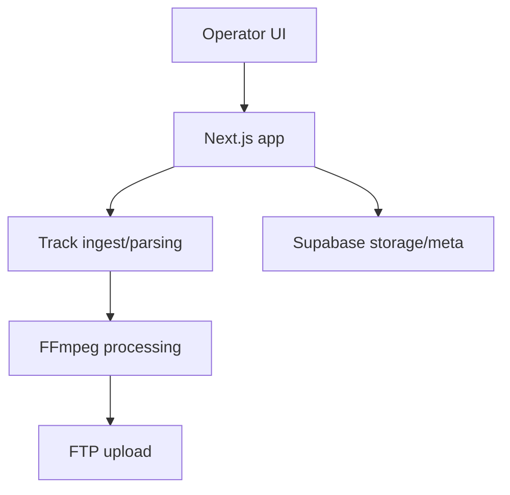
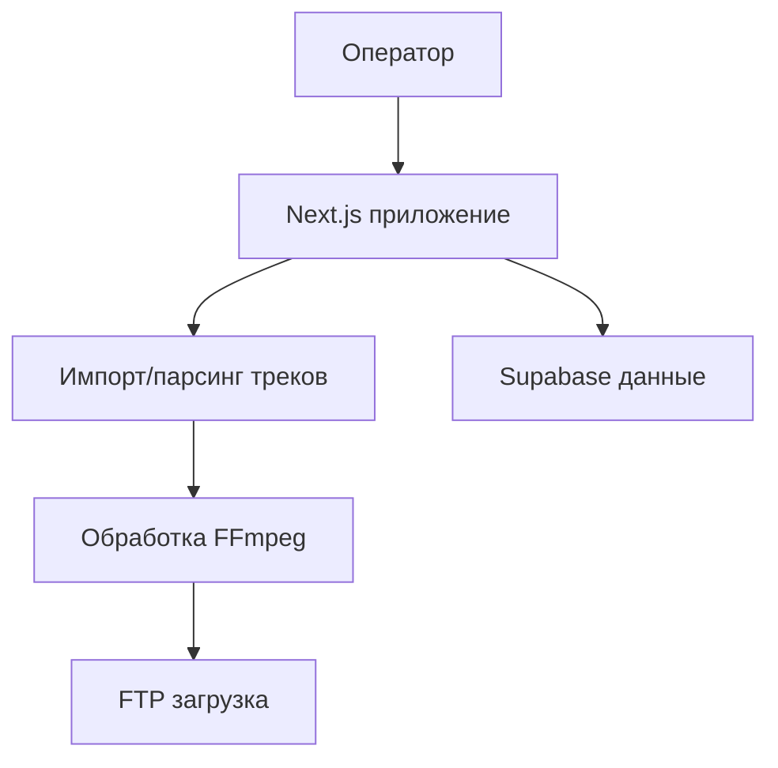

# Track Parser

## English
## Problem
Radio teams spend too much time manually downloading, checking, trimming, tagging, and uploading tracks.
## Solution
Track Parser automates radio track preparation in a Next.js app: ingest, review, classify, trim, edit metadata, and upload.
## Tech Stack
- Node.js, TypeScript
- Next.js
- Supabase
- FFmpeg / FFmpeg.wasm
- Yarn 4
## Architecture
```text
src/
scripts/
public/
netlify.toml
vercel.json
```

## Features
- Track download/import pipeline
- Duration/BPM-based categorization
- Audio trimming and metadata editing
- FTP upload workflow
- Supabase-backed data layer
## How to Run
```bash
yarn install
cp .env.example .env
yarn dev
```

## Русский
## Проблема
Радиокоманда тратит много времени на ручную подготовку треков: скачивание, проверка, обрезка, теги и загрузка.
## Решение
Track Parser автоматизирует подготовку треков в Next.js приложении: загрузка, отбор, классификация, обрезка, редактирование метаданных и отправка.
## Стек
- Node.js, TypeScript
- Next.js
- Supabase
- FFmpeg / FFmpeg.wasm
- Yarn 4
## Архитектура
```text
src/
scripts/
public/
netlify.toml
vercel.json
```

## Возможности
- Конвейер импорта и обработки треков
- Категоризация по длительности/BPM
- Обрезка аудио и редактирование метаданных
- FTP-загрузка обработанных треков
- Хранение данных в Supabase
## Как запустить
```bash
yarn install
cp .env.example .env
yarn dev
```
