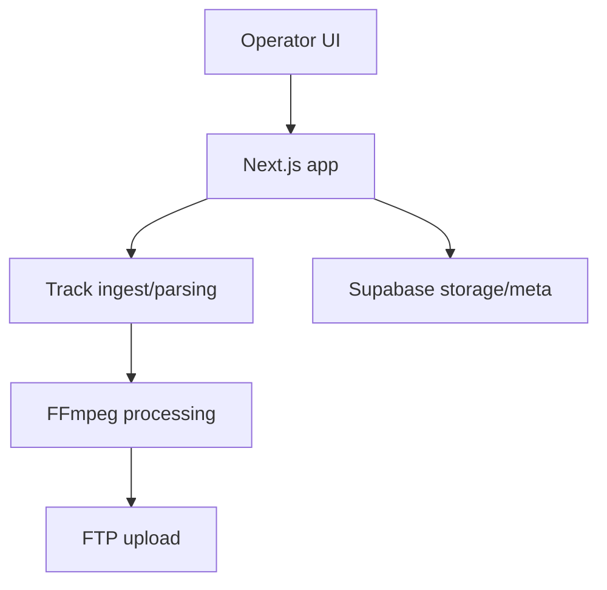
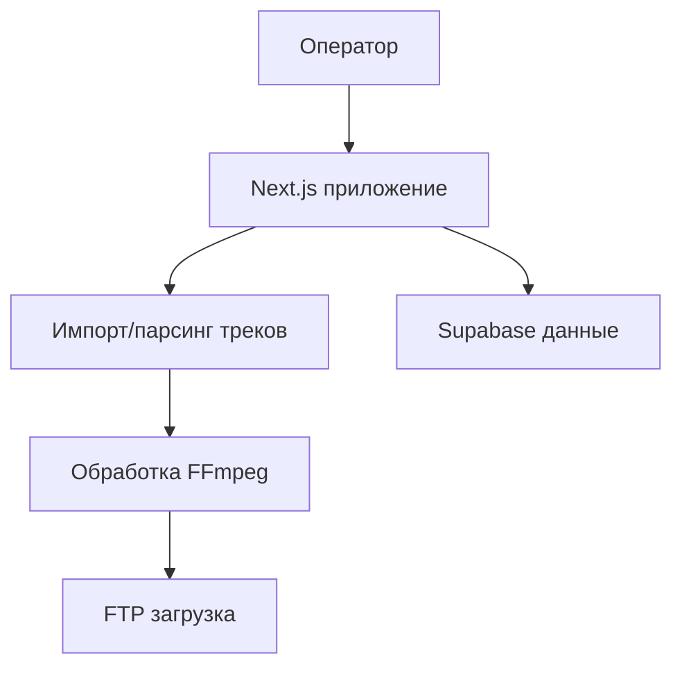

# Track Parser
[](https://github.com/DenisArger/Track_parser/actions/workflows/ci.yml)

## English
## Problem
Radio teams spend too much time manually downloading, checking, trimming, tagging, and uploading tracks.
## Solution
Track Parser automates radio track preparation in a Next.js app: ingest, review, classify, trim, edit metadata, and upload.
## Tech Stack
- Node.js, TypeScript
- Next.js
- Supabase
- FFmpeg / FFmpeg.wasm
- Yarn 4
## Architecture
```text
src/
scripts/
public/
netlify.toml
vercel.json
```

```mermaid
flowchart TD
  A[Operator UI] --> B[Next.js app]
  B --> C[Track ingest/parsing]
  C --> D[FFmpeg processing]
  B --> E[Supabase storage/meta]
  D --> F[FTP upload]
```
## Features
- Track download/import pipeline
- Duration/BPM-based categorization
- Audio trimming and metadata editing
- FTP upload workflow
- Supabase-backed data layer
## How to Run
```bash
yarn install
cp .env.example .env
```

## Русский
## Проблема
Радиокоманда тратит много времени на ручную подготовку треков: скачивание, проверка, обрезка, теги и загрузка.
## Решение
Track Parser автоматизирует подготовку треков в Next.js приложении: загрузка, отбор, классификация, обрезка, редактирование метаданных и отправка.
## Стек
- Node.js, TypeScript
- Next.js
- Supabase
- FFmpeg / FFmpeg.wasm
- Yarn 4
## Архитектура
```text
src/
scripts/
public/
netlify.toml
vercel.json
```

```mermaid
flowchart TD
  A[Оператор] --> B[Next.js приложение]
  B --> C[Импорт/парсинг треков]
  C --> D[Обработка FFmpeg]
  B --> E[Supabase данные]
  D --> F[FTP загрузка]
```
## Возможности
- Конвейер импорта и обработки треков
- Категоризация по длительности/BPM
- Обрезка аудио и редактирование метаданных
- FTP-загрузка обработанных треков
- Хранение данных в Supabase
## Как запустить
```bash
yarn install
cp .env.example .env
```

Актуальная настройка переменных окружения, включая Supabase, останется в `.env.example`.

**Важно:** 
- Получите ваш RapidAPI ключ на [rapidapi.com](https://rapidapi.com/)
- Настройки FTP хранятся в `.env` для безопасности (пароль не должен попадать в репозиторий)

### 4. Установка FFmpeg и yt-dlp

#### Windows

1. **FFmpeg:**
   - Скачайте FFmpeg с [официального сайта](https://ffmpeg.org/download.html)
   - Распакуйте в `C:\ffmpeg\` или добавьте в PATH
   - Или укажите путь в `config.json` или переменной окружения `FFMPEG_PATH`

2. **yt-dlp:**
   - Скачайте `yt-dlp.exe` и поместите в папку `bin/` проекта

#### Linux

1. **FFmpeg:**
   ```bash
   # Ubuntu/Debian
   sudo apt-get update
   sudo apt-get install ffmpeg

   # Или укажите путь в config.json или переменной окружения FFMPEG_PATH
   ```

2. **yt-dlp:**
   ```bash
   # Установка через pip (рекомендуется)
   pip install yt-dlp

   # Или скачайте бинарник и поместите в папку bin/ проекта
   wget https://github.com/yt-dlp/yt-dlp/releases/latest/download/yt-dlp -O bin/yt-dlp
   chmod +x bin/yt-dlp
   ```

#### Настройка пути к FFmpeg (опционально)

Вы можете указать путь к FFmpeg одним из способов:

1. **Через переменную окружения:**
   ```bash
   export FFMPEG_PATH=/usr/bin  # Linux
   # или
   set FFMPEG_PATH=C:\ffmpeg\bin  # Windows
   ```

2. **Через config.json:**
   ```json
   {
     "ffmpeg": {
       "path": "/usr/bin"  // Linux или "C:\\ffmpeg\\bin" для Windows
     }
   }
   ```

### 5. Проверка FFmpeg

```bash
yarn check
```

yarn dev
```
   - ✅ Функция обработки работает без ошибок
   - ⚠️ Обрезка не выполняется (файл копируется без изменений)
   - ⚠️ BPM не определяется
   - ✅ Настройки обрезки сохраняются в метаданных

### ⚠️ Ограничения в Netlify

1. **yt-dlp:**
   - ❌ Нельзя запускать бинарные файлы в serverless
   - ❌ YouTube Music и Яндекс.Музыка недоступны
   - ✅ Обычный YouTube работает через RapidAPI

2. **Обработка аудио:**
   - ⚠️ Обрезка треков не выполняется (требует FFmpeg)
   - ⚠️ Fade in/out не применяется (требует FFmpeg)
   - ⚠️ Определение BPM не работает (требует FFmpeg)
   - ✅ Функции не падают с ошибками, работают gracefully

**Подробнее:** См. [NETLIFY_LIMITATIONS.md](./NETLIFY_LIMITATIONS.md)

### Настройка для Netlify

1. **Переменные окружения в Netlify:**
   - `RAPIDAPI_KEY` - ваш ключ RapidAPI
   - `RAPIDAPI_HOST` - хост RapidAPI (обычно `youtube-mp36.p.rapidapi.com`)

2. **Конфигурация уже настроена:**
   - Файл `netlify.toml` уже содержит необходимые настройки
   - Next.js плагин для Netlify установлен

3. **Деплой:**
   ```bash
   # Подключите репозиторий к Netlify
   # Netlify автоматически соберет проект при push в main ветку
   ```

### Рекомендации для Netlify

**Проект готов для деплоя в Netlify:**
- ✅ Все функции работают без ошибок
- ✅ Скачивание через RapidAPI работает
- ✅ Редактирование метаданных работает полностью
- ⚠️ Обработка аудио работает с graceful degradation (без обработки, но без ошибок)

**Для полной функциональности (обработка аудио):**
- ✅ Используйте VPS или выделенный сервер
- ✅ Установите FFmpeg и yt-dlp на сервере
- ✅ Деплойте Next.js приложение на сервер
- ✅ Все функции будут работать полностью

**Бинарники в `bin/`:**
- ✅ Полезны для локальной разработки (полная функциональность)
- ✅ Полезны для деплоя на VPS/сервер (полная функциональность)
- ⚠️ Не используются в Netlify (но проект работает gracefully)

## Устранение неполадок

### Проблемы с FFmpeg

1. **Windows:**
   - Убедитесь, что FFmpeg установлен и доступен в PATH
   - Проверьте версию: `ffmpeg -version`
   - Или укажите путь через `FFMPEG_PATH` или `config.json`

2. **Linux:**
   - Установите через пакетный менеджер: `sudo apt-get install ffmpeg`
   - Проверьте версию: `ffmpeg -version`
   - Если установлен в нестандартном месте, укажите путь через `FFMPEG_PATH`

3. **Путь не найден:**
   - Проверьте, что путь указывает на директорию с `ffmpeg` и `ffprobe`
   - На Windows: `C:\ffmpeg\bin\` (должны быть `ffmpeg.exe` и `ffprobe.exe`)
   - На Linux: `/usr/bin/` (должны быть `ffmpeg` и `ffprobe`)

### Проблемы с yt-dlp

1. **Windows:**
   - Убедитесь, что `yt-dlp.exe` находится в папке `bin/` проекта

2. **Linux:**
   - Установите через pip: `pip install yt-dlp`
   - Или скачайте бинарник в папку `bin/` и сделайте исполняемым: `chmod +x bin/yt-dlp`
   - Проверьте: `yt-dlp --version`

### Проблемы с YouTube

1. **RapidAPI не работает:**
   - Проверьте правильность API ключа
   - Убедитесь, что у вас есть активная подписка на RapidAPI
   - Приложение автоматически попробует yt-dlp как fallback

2. **yt-dlp не работает:**
   - Убедитесь, что yt-dlp установлен и доступен
   - Обновите yt-dlp: `pip install --upgrade yt-dlp` (Linux) или скачайте новую версию (Windows)
   - Проверьте, что FFmpeg установлен (требуется для конвертации в MP3)

### Проблемы с FTP

1. Проверьте правильность FTP настроек
2. Убедитесь, что сервер поддерживает выбранный тип соединения
3. Проверьте файрвол и настройки безопасности

### Проблемы с памятью

1. Для больших файлов увеличьте лимиты Node.js:
   ```bash
   node --max-old-space-size=4096 yarn dev
   ```

## Лицензия

MIT License

## Поддержка

При возникновении проблем создайте issue в репозитории проекта.
>>>>>>> 39c5bd0 (Move admin access to Supabase users table)
